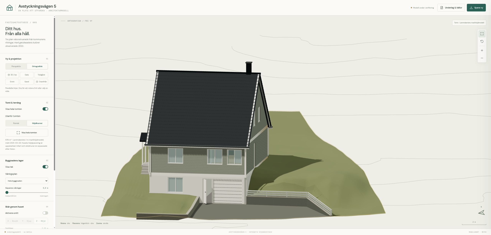
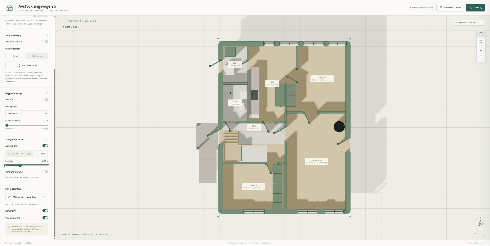
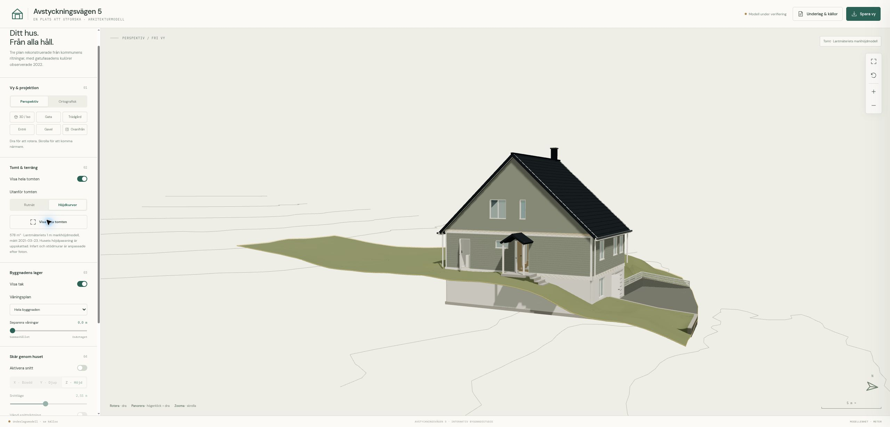

# Avstyckningsvägen 5

En interaktiv 3D-modell av huset och tomten på Avstyckningsvägen 5 i Viksjö, Järfälla. Utforska fasader och våningsplan, skär genom byggnaden och se hur huset möter den sluttande terrängen. Byggd med JavaScript, Three.js och Vite och körs direkt i webbläsaren.



## Utforska modellen

- **Välj vy:** perspektiv eller ortografisk projektion, fri rotation och fasta vyer från varje sida eller ovanifrån.
- **Öppna huset:** dölj taket, isolera ett våningsplan eller separera våningarna i höjd.
- **Lägg ett snitt:** skär genom huset i bredd, djup eller höjd och se rummens samband.
- **Visa hela tomten:** terräng inom fastighetsgränsen, med enkelt rutnät eller höjdkurvor i omgivningen. Garageinfarten har beläggning och stödmurar anpassade efter bilder.
- **Mät och spara:** mät mellan synliga ytor, spara en vy som PNG eller ladda ned huset som GLB för exempelvis Blender.

Dra för att rotera, högerdra för att panorera och skrolla för att zooma. För en planvy: välj **Ortografisk → Ovanifrån**, ett våningsplan och ett höjdsnitt genom rummen.





## Kör lokalt

Använd Node.js 24, samma version som i CI. Minimikravet är Node.js 22.12.

```bash
npm ci
npm run dev
```

Öppna adressen som Vite visar, normalt <http://localhost:5173/>. Modell, terräng och källbilder ingår i projektet; appen behöver ingen backend eller API-nyckel.

```bash
npm test             # Geometri, snitt, tomt och markanpassningar
npm run build       # Bygg den statiska webbappen till dist/
npm run preview     # Förhandsgranska bygget lokalt
```

Bygget kan publiceras på statisk hosting. Projektet innehåller CI och ett manuellt arbetsflöde för GitHub Pages. Se [publiceringsguiden](docs/publicering.md).

## Underlag och noggrannhet

Huset är rekonstruerat från kommunala ritningar från **2007**, en måttsatt typritning från **1971** och fasadbilder från **2022**. Tomten är cirka **578 m²** enligt kommunens karta. Terrängen bygger på **Lantmäteriets markhöjdmodell med 1 m upplösning**, mätt över platsen den **23 mars 2021**. Infart och stödmurar är lokala, fototolkade anpassningar av markytan.

Modellen är en tolkning av underlagen. Dagens interiör, husets exakta höjdläge och murarnas mått har inte kontrollmätts. Mätverktyget visar avstånd i modellens skala. [Underlag och modellbeskrivning](docs/underlag.md) redovisar källor, antaganden, export och hur terrängdata återskapas.

Höjddata: **© Lantmäteriet**, [CC BY 4.0](https://creativecommons.org/licenses/by/4.0/), bearbetade genom utsnitt, koordinattransformation och resampling. Övriga källor och bildattribueringar finns i [källförteckningen](research/sources.md) och i appens **Underlag & källor**.

## Projektstruktur

```text
src/        Visare, husgeometri, snitt och terräng
public/     Färdig terrängdata, GLB-modell och källbilder
scripts/    Export av husmodell och bearbetning av höjddata
tests/      Geometri- och datatester
docs/       Skärmbilder, modellbeskrivning och publicering
research/   Källunderlag, tolkningar och verifiering
```
